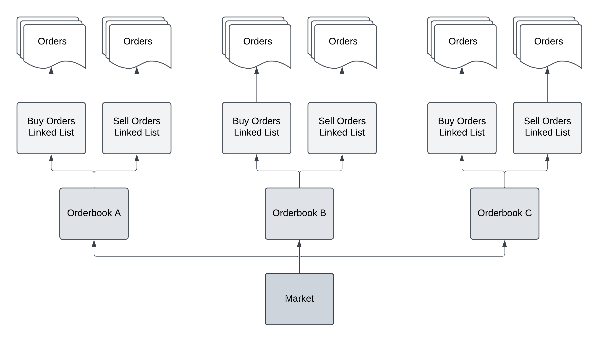
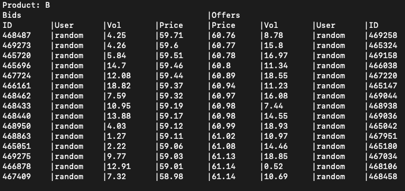

<!-- TOC -->
* [Introduction](#introduction)
* [Market](#market)
  * [OOP Structure](#oop-structure)
  * [Asynchronous operation](#asynchronous-operation)
  * [Unique ID generator](#unique-id-generator)
* [gRPC implementation](#grpc-implementation)
  * [Multi-threading on the Server side](#multi-threading-on-the-server-side)
  * [Multi-threading on the Client side](#multi-threading-on-the-client-side)
* [Mongo database](#mongo-database)
  * [Requirements](#requirements)
  * [Indexes](#indexes)
  * [Interface using a lock-free queue](#interface-using-a-lock-free-queue)
* [Performance](#performance)
  * [Simulation](#simulation)
  * [Optimization](#optimization)
* [Further development](#further-development)
  * [Communicating deals to concerned clients](#communicating-deals-to-concerned-clients)
  * [Streaming tick data (L3 Market data)](#streaming-tick-data-l3-market-data)
  * [Implementing market maker bots](#implementing-market-maker-bots)
  * [Improving time complexity with ordered maps instead of linked lists](#improving-time-complexity-with-ordered-maps-instead-of-linked-lists)
<!-- TOC -->

# Introduction
This project simulates a trading platform service that enables traders to submit and interact with orders. The goal of 
the project is to showcase my knowledge in computer science, with a particular focus on C++, concurrency, and 
multi-threading. The development of this project spanned several months, during which I was concurrently studying these 
concepts, leading to varied implementation approaches across different parts of the codebase.
For example, the market structure, developed early on, uses raw pointers along with the necessary destructors 
and relies on locking mechanisms for concurrency.
In contrast, the more recent features employ smart pointers and incorporate a 
[templated lock-free queue](lock_free_queue/LockFreeQueue.h) for more efficient, lock-free operations.

# Market
## OOP Structure
The market is a central entity offering access to various traded products, each represented by a unique orderbook. In
the object-oriented design, a [Market](market/Market.h) object consists of a collection of [Orderbook](market/OrderBook.h) 
objects.
Each orderbook contains two [OrderLinkedList](market/OrderLinkedList.h) objects,
which are linked lists of [Order](market/order/Order.h) objects. 

This system forms a reverse pyramid, where
higher-level modules do not depend on lower-level modules, thus adhering to the **Dependency Inversion Principle** 
within the **SOLID** principles.

Concerns are clearly separated across classes; for instance, the Market class dispatches trader requests to the
Orderbook, which handles their execution.
The OrderLinkedList and Order classes are specialized containers designed specifically for this project.

## Asynchronous operation
Since orders can be sent simultaneously by different traders, maximizing parallel execution is essential. Fairness is 
ensured by prioritizing request handling based on the order of arrival. However, because requests might overlap in 
execution, each Orderbook processes one request at a time to maintain synchronous operations within each orderbook. 
Similarly, dispatching by the Market must be synchronous to maintain fairness.

Therefore, concurrency is limited to a single thread per Orderbook and an additional thread for the Market. Each Orderbook 
includes a [Customer Request Queue](market/CustomerRequestQueue/CustomerRequestQueue.h) to store dispatched requests. 
This queue allows concurrent access by having a lock on each node, so one push and one pop operation can occur simultaneously.

## Unique ID generator
To ensure that all generated order IDs are unique, the project uses a single ID generator. This is achieved through the
[GeneratorID](market/GeneratorId.h) implementation, which adheres to the **Singleton** design pattern.

# gRPC implementation
To separate the market provider from the traders, communication is handled through the gRPC framework, which provides
inter-process communication. The service and message structures are defined in the [proto file](proto/MarketAccess.proto) 
and support four types of requests: insertion, deletion, update, and display.

Traders use the first three requests to manage their orders in the market, while the display request returns the current 
state of the orderbook as a string.

## Multi-threading on the Server side
To handle incoming requests, gRPC uses a completion queue, which enables asynchronous processing. The server employs
[RequestHandler](server_and_client_grpc/Service/RequestHandler.h) objects to manage each request type. When a new 
request is retrieved from the completion queue, it is 
assigned to a RequestHandler, and the associated computations are executed in a separate thread, allowing for 
asynchronous handling on the server side.

To maintain synchronous ordering of requests within a single orderbook, each RequestHandler thread registers with the 
relevant orderbook by pushing a [RequestNode](market/CustomerRequestQueue/RequestNode.h) into the orderbook’s
[Customer Request Queue](market/CustomerRequestQueue/CustomerRequestQueue.h) (illustrated in the diagram 
below). The thread then waits until it receives a signal to proceed, which is managed by the _runNextRequest_ function 
in the Customer Request Queue, ensuring requests are processed in their arrival order.

Each RequestNode contains a status variable along with a mutex-condition variable pair. These elements create a 
communication mechanism between the request thread and the single queue thread running _runNextRequest_, which controls
the orderly execution of requests and prevents simultaneous modifications to the orderbook.

## Multi-threading on the Client side
As the client receives responses to its requests, it must update its view of the orders. This update process is managed 
by specialized _handleResponse functions within the abstract [ClientAsync](server_and_client_grpc/Client/ClientAsync.h) 
class, which are overridden in the derived classes 
[Randomizer Client](server_and_client_grpc/Client/RandomizerClient/RandomizerClient.h) and 
[Display Client](server_and_client_grpc/Client/DisplayClient/DisplayClient.h) to meet their specific requirements.

ClientAsync uses a Boost thread pool to process responses asynchronously.
Based on testing, the thread count in the pool has been fixed at one thread for DisplayClient and two threads for 
RandomizerClient. 

# Mongo database
## Requirements
The database in this project is designed primarily for performance checks or reconciliation tasks, such as back-office 
invoicing. To meet these needs, every version of an order is saved, making the database heavily write-intensive with 
infrequent reads. While the rigid structure of the order might suggest using an SQL database, I chose MongoDB to explore
NoSQL, as I had already implemented an SQL-based solution in my 
[Option Pricer App](https://github.com/PLHC/option-pricer-app).

## Indexes
Two indexes are used in the database design:
- **Order ID Index**: Sorted by Order ID, this index allows the system to extract the maximum ID during the 
initialization of the [GeneratorID](market/GeneratorId.h).
- **Trades Date Index**: Sorted by trade date, this index facilitates reconciliation tasks.

## Interface using a lock-free queue
The database interface is implemented as a **Singleton** via the [DatabaseInterface](database/DatabaseInterface.h) class. 
To reduce the transaction cost of database operations, new entries are batched before being inserted into the database.

To enable communication between the Orderbook and the database, a [LockFreeQueue](lock_free_queue/LockFreeQueue.h) is 
included in the [DatabaseInterface](database/DatabaseInterface.h). 
This queue allows multiple Orderbook instances to push data concurrently, while a dedicated thread processes these 
entries in bulk, optimizing database interactions.

# Performance
## Simulation
The simulation creates three traded products and runs on a Mac M1. A single process hosts both the 
[Market](market/Market.h) and the [Server](server_and_client_grpc/Service/RpcServiceAsync.h) to handle and process all 
client requests. 
A [Randomizer Client](server_and_client_grpc/Client/RandomizerClient/RandomizerClient.h) process simulates multiple 
traders’ activity, maintaining around 1,000 orders in each orderbook by issuing one update, deletion, or insertion 
request per orderbook every 200µs—resulting in approximately 15,000 requests per second when simulating three traded 
products.

A [Display Client](server_and_client_grpc/Client/DisplayClient/DisplayClient.h) process displays the market state in the
terminal, updating the view of the various orderbooks 20 times per second (see image below). 
Finally, database insertion time per client request has been measured between 7 and 15µs.

## Optimization
To optimize performance, move semantics were applied extensively, particularly for string members within order data. 
This increased the simulation’s processing capability from under 10,000 requests per second to approximately 30,000 
requests per second.

The database insertion time for individual requests was initially measured at 200–300µs.
After testing multiple sizes of bulk operations, batching 500 market updates at a time reduced insertion time by a 
factor of 20.

# Further development
## Communicating deals to concerned clients
Currently, the RandomizerClient updates its view on trades by having requests rejected if their version is older than 
the current state of the order. 
However, the market should notify the concerned traders of a deal, ensuring that all clients are kept up to date on
relevant transactions.

## Streaming tick data (L3 Market data)
All actions happening on the market should be streamed, allowing clients to receive real-time updates. 
This will enable clients to build bots that can respond to market events dynamically.

## Implementing market maker bots
Currently, only one client is connected to the market in the simulation. 
Future developments should involve adding more clients with automated behaviors, 
such as market-making bots that continuously quote buy and sell prices.

## Improving time complexity with ordered maps instead of linked lists
The time complexity for inserting an order in the orderbook is currently O(n), 
where n is the number of orders in the orderbook. 
By using a map and a linked list for each price in the map, 
performance could be improved by reducing the time complexity for finding a price to O(log n). 
However, in the worst case, when all orders are at the same price, the time complexity would still remain O(n), 
as the orders would be stored in a linked list.
