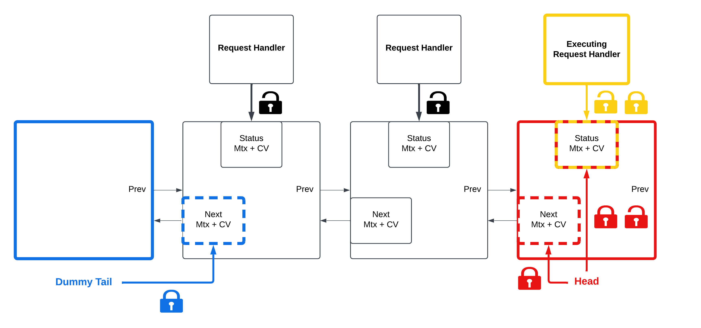

<!-- TOC -->
* [Introduction](#introduction)
* [Market](#market)
  * [OOP Structure](#oop-structure)
  * [Asynchronous operation](#asynchronous-operation)
  * [Unique ID generator](#unique-id-generator)
* [gRPC implementation](#grpc-implementation)
  * [Multi-threading on the Server side](#multi-threading-on-the-server-side)
  * [Multi-threading on the Client side](#multi-threading-on-the-client-side)
* [Mongo database](#mongo-database)
  * [Requirements](#requirements)
  * [Indexes](#indexes)
  * [Interface using a lock-free queue](#interface-using-a-lock-free-queue)
* [Performance](#performance)
  * [Simulation](#simulation)
  * [Optimization](#optimization)
* [Further development](#further-development)
<!-- TOC -->

# Introduction
This project implements and simulates a trading platform service enabling traders to send and interact with orders. The
purpose of this project is to demonstrate the knowledge I acquired in the field of computer science and more
particularly about C++, concurrency, and multi-threading. As the project was written over a few months in parallel to
studying the concepts, the implementation choices are heterogeneous between the main parts. For this reason, the market
structure having been coded early relies on raw pointers
(including the required destructors) and locking concurrency mechanisms; whereas the lately implemented features use
smart pointers and a [templated lock-free queue](lock_free_queue/LockFreeQueue.h).

# Market

## OOP Structure

The market is one entity offering access to different traded products, each represented by a unique orderbook. In OOP,
a [Market](market/Market.h) object is made of a collection of [Orderbook](market/OrderBook.h) objects. Each orderbook
consists of two [OrderLinkedList](market/OrderLinkedList.h) objects, which are linked lists of
[Order](market/order/Order.h) objects. The system can be seen as a reverse pyramid in which the higher-level modules do
not depend on lower-level modules, thus it follows the **Dependency Inversion Principle** (**SOLID** principles).

Moreover, the concerns are clearly separated between the classes, e.g., Market dispatches the trader
request to the Orderbook, which handles its execution.
On the other hand, OrderLinkedList and Order are containers 
designed for this project.

## Asynchronous operation

As orders can be sent by different traders simultaneously, it becomes interesting to maximize parallel execution.
Fairness is guaranteed if priority in request handling is defined by order of arrival. As requests could overlap in
their execution, it is necessary to handle one request at a time on a single Orderbook, so operations are synchronously
executed in each Orderbook. Similarly, the dispatch performed by Market requires to be made synchronously to maintain
fairness. Concurrency is therefore limited to a thread per Orderbook and one more for the Market. Finally,
a [Customer Request Queue](market/CustomerRequestQueue/CustomerRequestQueue.h) object is included in every Orderbook and
is used to store the dispatched requests. Using a lock per node in the queue, a single push and a single pop operation
can occur concurrently.

## Unique ID generator

To guarantee generated order IDs are unique, it is necessary to limit the project to a single ID Generator. For that
purpose, [GeneratorID](market/GeneratorId.h) implementation follows the **Singleton** design principle.

# gRPC implementation

To separate the market provider from the traders, communication is built using the gRPC framework. It encapsulates methods
to communicate between processes. The service and the message structures are defined in
the [proto file](proto/MarketAccess.proto)and offer four kinds of requests: insertion, deletion,
update, and display.
The traders use the first three to interact with their orders in the market, whereas the latter one
returns the orderbook content as a string.

## Multi-threading on the Server side

To handle the different requests, gRPC provides a completion queue. The service relies
on [RequestHandler](server_and_client_grpc/Service/RequestHandler.h)
objects to provide the methods to handle each request. 
When a new request is popped from the completion queue, it gets assigned to a RequestHandler, and the computations are
run in a separate thread. This allows asynchronous handling of requests on the server side. As discussed in the previous 
sections, to respect synchronous ordering of
requests from a single orderbook point of view, each RequestHandler thread registers to the orderbook by pushing
a [RequestNode](market/CustomerRequestQueue/RequestNode.h)
in the orderbook's [Customer Request Queue](market/CustomerRequestQueue/CustomerRequestQueue.h) (see picture below). The thread then waits
for its turn to process by waiting for a signal from the _runNextRequest_ function in the Customer Request
Queue that allows idle requests to execute by order of arrival.
For this purpose each RequestNode includes a status variable and a pair of mutex and condition variable
to build the mechanisms of communication between the request thread and the unique queue thread running the 
_runNextRequest_ function.

## Multi-threading on the Client side

As the Client received answers for its requests, it needs to update its view on orders. This is implemented by the specialized 
 _handleResponse_ functions in the abstract [ClientAsync](server_and_client_grpc/Client/ClientAsync.h) class and 
override in the derived classes [Randomizer Client](server_and_client_grpc/Client/RandomizerClient/RandomizerClient.h) 
and [Display Client](server_and_client_grpc/Client/DisplayClient/DisplayClient.h) to fill the different needs.
ClientAsync includes a _Boost_ threadpool to process the responses asynchronously.
Following some tests, the number of threads has been fixed: one for DisplayCLient and two for RandomizerClient.  

# Mongo database

## Requirements

The database in this project is designed to be used for performance check or for reconciliation, e.g., back office
invoicing. Every version of an order needs to be saved, and therefore the database is mainly used for insertion and
rarely for reading. As the structure of the order is rigid, using SQL could have been judged better, but as I already
implemented one in my [Option Pricer App](https://github.com/PLHC/option-pricer-app), I decided to learn about NoSQL
through a Mongo database.

## Indexes

Two indexes were created:

- sorted by Order ID to be able to extract the latest max ID when initializing the [GeneratorID](market/GeneratorId.h)
- trades sorted by date to be used to reconcile.

## Interface using a lock-free queue

Once again, the interface is limited to one entity and [DatabaseInterface](database/DatabaseInterface.h) follows the
**Singleton** design principle. To minimize the transaction cost of a database request, new inputs are combined in bulk
before being inserted in the database. Finally, for the Orderbook to communicate the events,
a [LockFreeQueue](lock_free_queue/LockFreeQueue.h) is included in the [DatabaseInterface](database/DatabaseInterface.h)
in which several Orderbooks can push simultaneously while a single thread is popping and bulking order events.

# Performance

## Simulation

The simulation creates three traded products and is run on a Mac M1. The first process combines
the [Market](market/Market.h)
and the [Server](server_and_client_grpc/Service/RpcServiceAsync.h) to handle and process all client requests.
A [Randomizer Client](server_and_client_grpc/Client/RandomizerClient/RandomizerClient.h) process is simulating the
activity of the multiple traders on the market. It creates and maintains around 1000 orders in each orderbook by sending
one update/deletion/insertion request per orderbook every 200µs, resulting in 15,000 requests per second.
A [Display Client](server_and_client_grpc/Client/DisplayClient/DisplayClient.h) process is used to display the state of
the market in the terminal (see picture below), requesting a view update of the different orderbooks 20 times a second. Finally, database insertions cost
per client request has been measured between 7 and 15µs.

## Optimization

Order information relies on multiple string member variables. To improve performance, the use of move semantics has been
maximized. This resulted in the 3-product simulation to be able to handle ca. 30,000 requests per second, compared to
less than 10000r/s before. 

Single request database insertion has been measured at 200–300µs.
Testing multiple sizes of bulks, this number has been divided by 20 by creating bulks of 500 market updates.

# Further development

**Communicating deals to concerned clients:** currently RandomizerClient updates its view on trades by getting its new 
request rejected when they versioned older than the current state of the order. The market should notify the concerned 
traders of a deal.

**Streaming tick data:** similarly, all the action happening on the market should be streamed to enable clients to build 
bots.

**Implementing market makers bots from the tick data:** in the current simulation only one client is connected, more 
should be added and with automated behaviors, e.g., Market makers.

**Using ordered map instead of linked lists:** the time complexity to insert an order in the orderbook is O(number of 
orders in Orderbook). By using a Map and a Linked List for each price in the Map, the performance would be improved as 
finding a price would become logarithmic. Nevertheless, the worst case being with all the orders at the same price, the 
time complexity is still O(number of orders in Orderbook).
 

